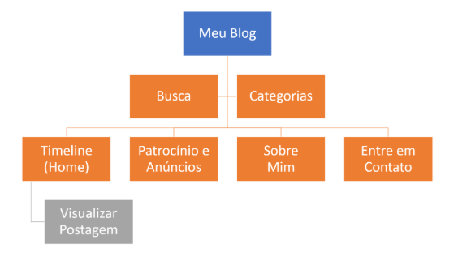

# PUCMINAS
## Especialização: Análise e Desenvolvimento de Sistemas 
### Aula 01: Padrões Web HTML, CSS

#### Mãos na Massa - Site Blog (Somente HTML)
- criar pagina HOME, arquivo index.html 
- criar componente MENU
- criar componente POSTAGENS
- criar componente PESQUISAS
- criar componente CATEGORIAS
- criar pagina PATROCINIOS E ANUNCIOS, arquivo anuncios.html
- criar pagina SOBRE MIM, arquivo sobre.html
- criar pagina CONTATO, arquivo contato.html

#### Mapa do site

